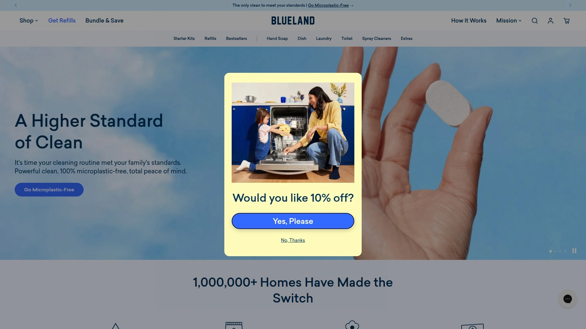

# Latest Eco-Friendly Cleaning Products Compilation (Including Detailed Reviews)

Scrubbing your kitchen counters with a spray bottle that's supposedly "natural" but lists seventeen unpronounceable chemicals on the back label doesn't feel very natural at all. Add the fact that you're tossing a plastic bottle into the trash every few weeks, and the whole eco-friendly cleaning thing starts looking like marketing theater. Traditional cleaning products fill landfills with single-use plastic, pump questionable chemicals into wastewater systems, and somehow still charge premium prices for the privilege of feeling guilty about both.

Sustainable cleaning products finally cracked the code by rethinking the entire system—not just swapping one toxic ingredient for another plant-based one. The new generation of eco-friendly cleaning brands delivers refillable systems where you buy bottles once and reload them forever with concentrated tablets or paper-based refills. Plastic-free formulas arrive in compostable packaging, powerful enough to handle grease and grime without dousing your home in synthetic fragrances and questionable preservatives. Whether you're hunting for zero-waste dish soap, plastic-free laundry detergent, or multipurpose cleaners that actually work, these brands prove that green cleaning doesn't mean compromising on results.

***

## **[Blueland](https://www.blueland.com)**

Microplastic-free tablet system with reusable bottles and industrially compostable packaging.

Over one million homes have made the switch to Blueland's innovative cleaning system, which replaces traditional liquid cleaners with small tablets that dissolve in water. The core concept eliminates single-use plastic bottles entirely—you purchase forever bottles once, then refill them indefinitely with tablets that arrive in compostable packaging rather than more plastic. Each cleaning tablet contains concentrated, water-free formulas proven effective through 100,000+ five-star reviews and counting.

The product range covers every cleaning need from kitchen to laundry room: Clean Essentials Kit includes multi-surface spray, glass cleaner, and bathroom cleaner, while specialized offerings handle dish soap, hand soap, laundry detergent, and dishwasher tablets. The brand launched its bestselling Dishwasher Detergent Tablets in an improved formula with Lemon Zest scent, addressing customer feedback while maintaining plastic-free credentials. Garden Blooms collection introduces new hand soap fragrances inspired by backyard gardens, expanding scent options beyond the original lineup.

Safety certifications matter here—formulas are certified safe for use around kids and pets while maintaining powerful cleaning performance verified by independent testing. The value proposition extends beyond environmental benefits: space-saving tablets cost less than constantly buying full-size bottles while taking up a fraction of cabinet space. Blueland achieved Climate Neutral Certification and maintains carbon-neutral shipping, B-Corp status, Leaping Bunny Certification, and USDA BioPreferred recognition. Customer testimonials consistently praise effectiveness: "LOVE. I am an obsessive cleaner and I am extremely pleased with the effectiveness and will definitely be buying refills" notes one verified buyer.

---

## **[Grove Collaborative](https://www.grove.co)**

One-stop eco-conscious retailer with proprietary refillable concentrates and curated sustainable brands.

Grove Collaborative functions as both a brand and a platform, offering its own line of cleaning concentrates alongside carefully vetted products from companies like Mrs. Meyer's, Method, and Seventh Generation. The Grove community has collectively saved over 27 million pounds of plastic since 2020—equivalent to 907 million standard water bottles—through the platform's refillable systems and plastic-reduction initiatives. Every cleaning product sold meets strict standards: free from ammonia, chlorine, heavy metals, parabens, phthalates, and formaldehyde.

Grove's proprietary cleaning concentrates arrive in two one-ounce glass bottles that dilute with water in reusable glass spray bottles sold separately. This system prevents the repeated shipping of mostly water—traditional spray cleaners contain 95% water—focusing transport energy on concentrated formulas instead. The concentrates come in multiple fragrances that users describe as "delicious" rather than overwhelming, with formulas tackling multi-purpose cleaning, glass, kitchen, and bathroom surfaces.

The subscription model keeps homes stocked with automatic refill deliveries while offering flexibility to delay or cancel anytime. In 2021, Grove announced plans to achieve complete plastic-free operations by 2025, demonstrating long-term commitment beyond marketing promises. Product performance receives mixed but generally positive reviews—some items excel while others fall slightly short of conventional alternatives, though most users find the trade-off worthwhile for environmental benefits. Grove serves as a discovery platform for sustainable brands, introducing customers to emerging eco-friendly companies while maintaining accessibility through wide retail distribution including major stores.

***

## **[Branch Basics](https://branchbasics.com)**

Single concentrate replacing every cleaner in your home with human-safe plant and mineral ingredients.

Branch Basics built its entire business around one product: The Concentrate, a plant and mineral-based formula that replaces dozens of specialized cleaning products through simple dilution ratios. Mix one part concentrate with eleven parts water for all-purpose cleaning, one-to-five for bathroom surfaces, one-to-four for foaming hand wash, and one-to-two for laundry detergent—eliminating the need for separate products cluttering cabinets. This streamlined approach appeals to minimalists tired of managing countless half-empty bottles.

The formula contains no fragrances, dyes, harsh preservatives, endocrine disruptors, or ethoxylated alcohols, earning Made Safe Certification and Leaping Bunny Certification for cruelty-free practices. Ingredients include recognizable components like baking soda and organic chamomile rather than synthetic chemicals requiring chemistry degrees to pronounce. The concentrate handles heavily soiled laundry and sensitive newborn skin equally well without irritation, demonstrating versatility across cleaning scenarios.

Starter kits provide bottles with clear fill lines indicating proper dilution ratios, removing guesswork from the mixing process. An eight-ounce concentrate bottle creates six all-purpose cleaners, three bathroom cleaners, or five stain removers depending on dilution strength chosen. The refill system reduces waste significantly—instead of buying new bottles repeatedly, customers purchase concentrate refills that ship in sturdy kraft paper bags or recyclable containers. Branch Basics targets users seeking maximum simplicity: one formula, matching aesthetically pleasing glass bottles, and the relief of solving the problem of miscellaneous cleaning products accumulating everywhere. Target and other major retailers now carry Branch Basics, making the previously specialty product widely accessible.

***

## **[Seventh Generation](https://www.seventhgeneration.com)**

Plant-based cleaning and paper products with EPA Safer Choice certification and 97% biobased formulas.

Seventh Generation positions itself as the accessible eco-friendly option, available at virtually every major retailer including Target and Home Depot while maintaining genuine environmental standards. The brand uses plant science to create products effective against 60 of the toughest everyday stains while remaining safer for families than conventional alternatives. EPA Safer Choice Certification on laundry and dish products confirms independent verification of safety claims rather than relying on self-certification.

Product categories span complete household cleaning needs: ultra-concentrated laundry detergents with stain-fighting enzymes, automatic dishwasher detergents and liquid dish soap made from renewable plant-based ingredients, surface cleaners for wood, glass, and tile, disinfectants killing 99.9% of bacteria and viruses in one step, and paper products made from minimum 50% post-consumer recycled content. Fragrance options include both unscented formulas for sensitive skin and scented versions using 100% essential oils and botanical ingredients rather than synthetic fragrances.

The brand name references the Iroquois philosophy of considering seven generations ahead when making decisions, reflecting long-term environmental thinking embedded in company values. Recent campaigns emphasize the power of biobased formulas to tackle human messes: "Human Nature is messy. Thankfully, Nature Nature is powerful enough to save us from ourselves" summarizes their positioning. USDA Certified 97% biobased formula in laundry detergent demonstrates measurable commitment to plant-derived ingredients. Seventh Generation strikes the balance between environmental responsibility and mainstream accessibility—you don't need to visit specialty stores or navigate complicated ordering systems to stock your home with their products.

***

## **[Dropps](https://www.dropps.com)**

Plastic-free laundry and dishwasher pods with carbon-neutral shipping and B-Corp certification.

Dropps claims invention of the laundry detergent pod in 2005, giving them nearly two decades of experience perfecting the format before plastic-free alternatives became trendy. The Pennsylvania-based family company transformed from traditional operations into a Certified B-Corp with carbon-offset shipping, minimal cardboard packaging containing no plastic bags or boxes, and mostly plant-based formulas earning Leaping Bunny certification. Over 100,000+ 5-star reviews validate cleaning effectiveness across their product lines.

The pod format delivers precise dosing that prevents detergent overuse—most people use too much liquid detergent, wasting product and money while leaving residue on clothes. Dropps pods contain no dyes, chlorine, phosphates, or optical brighteners, with biodegradable formulas using plant-derived ingredients. Available varieties include Free & Clear Unscented for sensitive skin, 4-in-1 Plus Oxi Biobased Power for tough stains, and UltraWash Dishwasher Detergent in multiple scents.

One consideration worth noting: Dropps pods contain Poly Vinyl Alcohol (PVA), a polymer forming the dissolvable outer layer. While PVA can biodegrade, it requires specific wastewater treatment conditions not universally available in US facilities, potentially leading to partially degraded plastic in waterways. This represents a step up from traditional plastic bottles but not completely plastic-free despite marketing claims. The trade-off balances convenience and performance against perfect sustainability—Dropps acknowledges this complexity rather than making absolute claims. Pricing remains competitive with conventional options, especially through bulk purchases and subscription discounts offering 25% off first orders and 15% ongoing savings.

***

## **[Method](https://methodproducts.com)**

Design-forward biodegradable cleaners in 100% recycled plastic bottles from LEED-Platinum certified facilities.

Method revolutionized the cleaning aisle when founders Eric Ryan and Adam Lowry launched in 2000 with a radical proposition: cleaning products should perform excellently, look beautiful, and skip toxic chemicals entirely. The brand proved eco-friendly doesn't mean sacrificing aesthetics or effectiveness, growing into a $100M+ company and Certified B Corporation maintaining rigorous environmental and social responsibility standards. Their signature bright, modern packaging made from 100% post-consumer recycled plastic became a visual symbol of eco-chic living that changed how sustainable products are marketed.

Manufacturing happens at the South Side Soapbox factory in Chicago, a LEED-Platinum certified facility powered by renewable energy with advanced water recycling systems. This isn't just a soap factory—it's a model for sustainable 21st century manufacturing. Product formulas rely on plant-based and biodegradable ingredients carefully selected to prevent environmental pollution, with Method pioneering these approaches when green cleaning remained a niche movement.

The product range covers kitchen cleaners (Clementine scent), universal cleaners (French Lavender), bathroom cleaners tough on limescale and soap scum, dish soap dissolving stubborn dirt (Peach & Pink Pepper), hand soap with pure plant surfactants (Pink Grapefruit), and floor cleaners for wood, stone, tiles, and laminate (Wild Rhubarb). Fragrances combine natural and safe synthetic components for fresh scents that feel intentional rather than overwhelming. Method is part of the SC Johnson family since merging with Ecover in 2012, providing greater resources while preserving original brand values and B-Corp status.

***

## **[CleanCult](https://www.cleancult.com)**

Paper-based refill system with eternal aluminum bottles and Plastic Neutral Certification.

CleanCult was born from co-founder Ryan's spin cycle epiphany—his laundry detergent bottle listed zero recognizable ingredients. Research revealed disturbing truths about artificial chemicals in conventional cleaners, while "natural" alternatives weren't much better with toxic plastic packaging, indecipherable ingredients, and weak results. CleanCult addresses all three issues through recyclable paper-based refills, free-from-harsh-chemicals formulas, and powerful cleaning performance.

The system uses eternal aluminum bottles with recyclable paper refill cartridges, though transparency requires acknowledging aluminum bottles have non-recyclable plastic dispensers and cardboard containers include plastic spouts. CleanCult achieves Plastic Neutral Certification through rePurpose Global, partnering with organizations removing as much plastic from the environment as CleanCult uses in packaging. Consumer Reports testing covered nearly every CleanCult product at Target—some earned "winner" status while others rated "just fine," indicating real-world performance variability.

Product offerings include laundry detergent, laundry sheets, dish soap, hand soap, all-purpose cleaner, dishwasher tablets, and toilet bowl sheets. The laundry detergent, laundry sheets, and dish soap achieved significant distribution milestone by landing in select Whole Foods locations nationwide. Scents are described as "from the heavens" and "clean spirit," appealing to users wanting pleasant fragrances without synthetic chemicals. The refill ritual replaces bad plastic habits with cleaner practices—CleanCult believes lots of small actions add up to great change. Reddit users in zero-waste communities frequently compare CleanCult favorably against competitors for one-stop-shopping covering all cleaning needs with eco-friendly refills and nice aesthetics.

***

## **[Meliora](https://meliorameansbetter.com)**

Zero-waste cleaning products in paper and steel packaging with MADESAFE Certification and minimal-ingredient formulas.

Meliora means "better" in Latin, reflecting the company's vision for pristine, happy, healthy homes without secret formulas and mysterious chemicals. Owner Kate founded the company after studying for her Master's in Environmental Engineering, asking "what's in our cleaning products?" during research. This technical background shows in incredibly pure formulas with minimal ingredients that achieve cleaning effectiveness through chemistry rather than chemical cocktails.

Sustainability standards exceed most competitors—everything is free from single-use plastic, with many products completely plastic-free using paper or steel packaging instead. Zero-waste refills, bulk sizes, and glass bottles provide multiple options for different customer preferences and budgets. Meliora earned MADESAFE Certification (verified safe ingredients), B-Corp status (meeting rigorous social and environmental standards), 1% for the Planet membership (donating 1% of sales to environmental causes), and Leaping Bunny Certification (cruelty-free).

Product collection includes all-purpose spray, dish soap, scrub powder, and oxygen brightener for laundry. Formulas come unscented or with organic essential oils, appealing to fragrance-sensitive users and those wanting natural scents. The brand receives particular recognition as "most sustainable" among eco-friendly cleaning options due to plastic-free packaging commitments and minimal-waste approach. Refills ship in sturdy kraft paper bags that customers can recycle or compost depending on local facilities. Meliora products are available directly from the company website, Amazon, and through retailers like EarthHero, with discount codes sometimes available for first-time customers.

***

## **[ECOS](https://www.ecos.com)**

Family-owned affordable cleaners with carbon-neutral facilities powered by 100% renewable energy.

ECOS has operated as a family-owned company for over 50 years, making "green cleaning" reality through sustainable and mindful practices long before it became fashionable. The company's facilities run on 100 percent renewable energy using carbon- and water-neutral operations, with extra steps offsetting employees' commutes and minimizing emissions between sites. This comprehensive approach to sustainability extends beyond just product formulas into operational practices rarely matched by competitors.

The brand brought green cleaning to almost one million homes by delivering natural cleaning products at affordable prices accessible to average households rather than only wealthy consumers. Product range spans laundry detergent, dish soap, and multipurpose household cleansers including all-purpose cleaners and pet-specific formulas. A 22-ounce all-purpose cleaner costs approximately $7, positioning ECOS as one of the most budget-friendly options in the eco-friendly cleaning space.

ECOS gives back through various charitable initiatives including lobbying for environmental justice, restoring water to endangered habitats, and supporting the Childhood Cancer Prevention Initiative. Editor reviews highlight impressive performance: "ECOS is my top pick for an affordable, easily accessible option you can pick up at most retailers. What stood out most when using the dish soap was how one squirt stayed sudsy through hand-washing an entire sink full of dirty dishes". Green Seal certification and hypoallergenic formulas make ECOS appropriate for sensitive users, while bulk refills reduce packaging waste for long-term customers. The combination of affordability, accessibility, effectiveness, and genuine environmental commitment makes ECOS the entry point for households transitioning from conventional to sustainable cleaning products.

---

## How much do eco-friendly cleaning products cost compared to regular cleaners?

Eco-friendly cleaning systems often have higher upfront costs but lower long-term expenses than conventional products. Blueland starter kits range from $23-$150 with refills costing significantly less than buying new bottles repeatedly. Branch Basics concentrates start at $55-$75 but replace dozens of specialized cleaners, while brands like ECOS offer affordable options at $7 for 22 ounces, comparable to conventional cleaners. Refillable systems eliminate shipping water—you're paying for concentrated formulas rather than plastic bottles filled mostly with water.

## Are refillable cleaning tablets as effective as traditional liquid cleaners?

Yes, when formulas are properly designed. Blueland has 100,000+ five-star reviews confirming effectiveness, while independent testing shows tablet-based cleaners match or exceed conventional alternatives. The key difference is concentration—tablets contain the same active cleaning ingredients as liquids, just without 90-95% water added. Brands like Grove Collaborative and Branch Basics have refined dilution ratios ensuring proper strength when mixed at home. Consumer Reports testing of brands like CleanCult shows variable results, so checking reviews for specific products before committing to full systems makes sense.

## Can I use eco-friendly cleaning products if I have allergies or sensitivities?

Most sustainable cleaning brands specifically target sensitive users through fragrance-free formulas and minimal ingredient lists. Seventh Generation offers unscented versions EPA Safer Choice certified, while Branch Basics contains no fragrances, dyes, or harsh preservatives, making it safe for newborns. Dropps provides Free & Clear Unscented options, and Meliora specializes in formulas using organic essential oils or remaining completely unscented. ECOS maintains hypoallergenic formulations with Green Seal certification. The plant-based, minimal-ingredient approach common in sustainable cleaning typically benefits sensitive users more than conventional products containing synthetic fragrances and preservatives.

---

Cleaning your home shouldn't force you to choose between effectiveness and environmental responsibility, or between affordability and ingredients you actually recognize. The eco-friendly cleaning products landscape has matured beyond niche specialty items into genuinely viable alternatives that handle real-world messes without filling landfills with plastic bottles or pumping questionable chemicals into water systems. From tablet-based refill systems to concentrated formulas replacing entire cabinet collections, these brands prove sustainable cleaning can be simpler and more economical than the conventional approach.

[Blueland](https://www.blueland.com) particularly excels for households seeking the most straightforward transition to sustainable cleaning—microplastic-free tablets in compostable packaging, reusable forever bottles, and proven effectiveness validated by over a million satisfied customers make it the easiest entry point for families ready to eliminate single-use plastic from their cleaning routines. For anyone tired of mysterious ingredient lists and mounting plastic waste, these eco-friendly cleaning products deliver the clean home and clean conscience modern households deserve.
